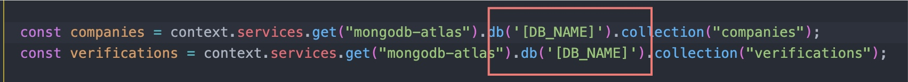

# Realm Env

Realm Env package builds realm functions/triggers on multiple environments.
Main purpose of this function is to avoid writing same function twice for 
development/staging/production environments.

## Setup

Install [realm-env](https://www.npmjs.com/package/realm-env) package in you application

Add script in  ``` package.json ```

```json
{
  "scripts": {
    "build-realm": "realm-env ./config.json"
  },
}
```

After you are done configuring Realm Env you to build your application on multiple environments run
```bash
$ npm run build-realm
```
OR
```bash
$ yarn build-realm
```

## Usage

you should wrap environment variables inside brackets

For example you have  ``` DB_NAME ``` variable set inside environment
syntax is as this follows



## Configuration

To configure Realm Env you should create one JSON configuration file

#### Parameters:
- functionsPath -> Path to your functions written in MongoDB Realm [function syntax](https://docs.mongodb.com/realm/functions/)
- triggersPath -> Path to your triggers written in MongoDB Realm [trigger syntax](https://docs.mongodb.com/realm/triggers/)
- destFolder -> Path where generated files will be placed
- realmConfig -> MongoDB Realm config.json file JSON [Object](https://docs.mongodb.com/realm/deploy/application-configuration-files/index.html#configuration) 
- functions -> Formatted list of function objects with following format
For Example you want to create ``` deleteUsers ``` function on dev environment
Syntax is as it follows
```json
{
  "functions": { // List of functions
    "deleteUsers": { // Function name
      "env": ["dev"] // List of function environments
    }
  },
}
```
- triggers -> Formatted list of trigger objects with following format
For Example you want to create ``` deleteUsers ``` trigger on dev environment
Syntax is as it follows
```json
{
  "triggers": { // List of triggers
    "deleteUsersTrigger": { // Trigger name
      "env": ["dev"] // List of triggers environments
    }
  },
}
```
- env -> List of Environment Configuration. For example you want to share ``` DB_NAME ``` environment variable syntax is as it follows:
```json
{
  "env": {
    "production": { // Environment Name
      "DB_NAME": "production" // Environment Variable
    },
    "staging": {
      "DB_NAME": "staging"
    },
    "dev": {
      "DB_NAME": "dev"
    }
  }
}
```


## Example Configuration
Example configuration of Realm Application where you want to create ``` deleteUsers ``` function and trigger on dev and staging environment
and share ``` DB_NAME ``` environment variable
```json
{
  "functionsPath": "./src/functions",
  "triggersPath": "./src/triggers",
  "destFolder": "./build",
  "functions": {
    "deleteUsers": {
      "env": ["dev", "staging"]
    }
  },
  "triggers": {
    "deleteUsersTrigger": {
      "env": ["dev", "staging"]
    }
  },
  "realmConfig": {},
  "env": {
    "production": {
      "DB_NAME": "production"
    },
    "staging": {
      "DB_NAME": "staging"
    },
    "dev": {
      "DB_NAME": "dev"
    }
  }
}
```